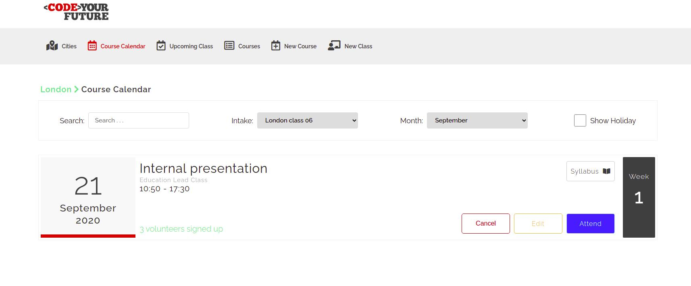

## Class Planner

This project's aim is to streamline and automate the process that we use to sign up  volunteers to attend class.

`git clone https://github.com/AKaramifar/Class-Planner.git` or if you use SSH (recommended):`git clone git@github.com:AKaramifar/Class-Planner.git`

#### [Installation and run backend]

- `create config.env file in config directory`
-  `ADD the following onto config.env you created before:
NODE_ENV=development
PORT=5000
MONGO_URI=your mongodb connection string` 
- `npm install`
- `npm run server`
 
 Server will be running on `http://localhost:5000`

#### [Installation and run frontend](./frontend/README.md)

- `cd frontend`
- `npm install`
- `npm start`

Client will be running on `http://localhost:4000`

#### [Installation and run both frontend and backend concurrently](./README.md)

- `cd frontend`
- `npm install`
- `cd ..` 
- `npm install`
- `npm run dev`

Server will be running on `http://localhost:5000`

Client will be running on `http://localhost:3000`

